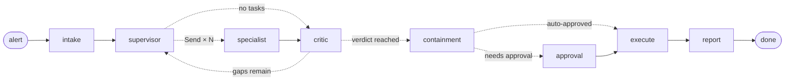

# AgenticIR

Self-hosted agentic incident response. A LangGraph agent swarm investigates
security alerts, reviews its own work, and proposes containment for human
approval — driven from Slack, a web dashboard, or n8n.

Ships with full infrastructure automation: **Terraform provisions a hardened
Hetzner server, cloud-init installs Coolify, and a bootstrap script deploys the
stack through Coolify's API.** One command from nothing to a running platform.

```
make provision     # Hetzner server → Coolify → application stack
```

---

## What it does

An alert arrives (SIEM webhook, Slack mention, or API call). A supervisor agent
plans the investigation and fans out to specialists that run **in parallel**.
A skeptical critic reviews their findings and either sends the team back for
another round or closes the investigation with a verdict. If containment is
warranted, the graph **pauses mid-run** and waits for a human — for minutes or
for days — then executes only what was approved.



| Agent | Role |
|---|---|
| **supervisor** | Plans each round and dispatches specialists. Does not investigate itself. |
| **triage** | What did the detection actually fire on, and is it plausibly real? |
| **enrichment** | Resolves indicators against threat intel via n8n tools. |
| **behavioral** | Reconstructs the activity sequence, maps to MITRE ATT&CK. |
| **critic** | Adversarial review. Sets the authoritative severity and verdict. |
| **containment planner** | Proposes the minimum effective response. |
| **reporter** | Writes the record an analyst reads and an auditor may re-read. |

Design decisions worth knowing:

- **Parallel by construction.** Specialists are dispatched with LangGraph `Send`,
  so they execute concurrently in one superstep. State uses additive reducers
  for `findings`/`timeline`/`errors`, which is what makes concurrent writes safe.
- **Approval policy is code, not prompt.** The model proposes actions;
  `containment.py` decides what needs a human, based on severity, reversibility
  and blast radius. A model cannot talk its way past the gate.
- **Failures degrade, they don't cascade.** A dead specialist records an error
  and the investigation continues. A dead supervisor falls back to a standard
  sweep. A dead report generator emits a structured fallback.
- **Round caps are enforced by the graph.** The critic can ask for another round;
  only `MAX_INVESTIGATION_ROUNDS` decides whether it gets one.
- **Durable.** Every superstep is checkpointed to Postgres. A container restart
  mid-investigation loses nothing; the thread resumes where it stopped.

---

## Quick start (local)

```bash
make venv                       # virtualenv + dev dependencies
cp .env.example .env            # add ANTHROPIC_API_KEY at minimum
make up                         # api + postgres + redis + n8n
```

| Surface | URL |
|---|---|
| Dashboard | http://localhost:8000/ui |
| API docs | http://localhost:8000/docs |
| n8n | http://localhost:5678 |

Run one investigation without any infrastructure:

```bash
make demo                       # uses examples/alert-suspicious-powershell.json
```

Send an alert through the API:

```bash
curl -X POST http://localhost:8000/v1/incidents \
  -H "X-API-Key: $API_KEY" -H 'Content-Type: application/json' \
  -d '{"alert": {"title": "Beaconing host", "severity": "high", "src_ip": "10.4.2.19"}}'
```

---

## Deploying

- **Onto Coolify you already run** → **[docs/DEMO.md](docs/DEMO.md)** — what's
  needed, the deploy sequence, and a scripted demo walkthrough.
- **From nothing, including the server** → **[docs/DEPLOYMENT.md](docs/DEPLOYMENT.md)**.

The full-provision short version:

```bash
cd infra/terraform
cp terraform.tfvars.example terraform.tfvars   # token, SSH key, your IP
terraform init && terraform apply              # server + firewall + volume + Coolify

make coolify-wait                              # block until Coolify is installed
# → open http://<ip>:8000, create the admin account, mint an API token

eval "$(terraform -chdir=infra/terraform output -raw bootstrap_env)"
export COOLIFY_API_TOKEN=... ANTHROPIC_API_KEY=...
export GIT_REPOSITORY=https://github.com/<you>/AgenticIR
make coolify-deploy                            # creates the resource and deploys
```

What Terraform builds:

- Hetzner server (default `cax31` — 8 vCPU ARM, 16 GB), Ubuntu 24.04
- Cloud firewall: 80/443 public, SSH + Coolify ports restricted to `admin_ips`
- Persistent volume mounted at `/data` (Coolify state, Postgres, n8n) with
  `prevent_destroy` — the server can be rebuilt without losing incident history
- Floating IP so DNS and webhook URLs survive a rebuild
- Private network, ready for a second node
- cloud-init: UFW, fail2ban, unattended security upgrades, SSH hardening, swap,
  kernel tuning, nightly backups, weekly image pruning, then Coolify

No domain? Leave `base_domain` empty and the stack uses `sslip.io` wildcard DNS —
resolves with zero configuration and still gets real Let's Encrypt certificates.

---

## The three surfaces

**Slack** — the day-to-day interface. Create the app from
`infra/slack/manifest.yaml`, invite the bot, then `@IR-Bot investigate <alert>`.
Every request is signature-verified with a 5-minute replay window, and handlers
ack inside Slack's 3-second budget.

The thread is the unit of work. An investigation narrates itself as it runs —
which specialists were dispatched and why, what each returned and how long it
took, the reviewer's verdict, the containment plan — so a two-minute gap reads
as progress rather than silence (`SLACK_PROGRESS_UPDATES`). Containment
approvals are buttons on that same thread.

With `SLACK_POLL_ENABLED` the bot also **sweeps the channel** every few minutes,
not just the messages that mention it. A cheap classifier sorts what it finds
into four buckets — start an investigation, add information to one already
reported, answer a question about one, or ignore it — and the sweep acts on at
most `SLACK_POLL_MAX_ACTIONS` of them per cycle. New information about a closed
incident re-enters the *same* LangGraph thread, so prior findings are kept and a
labelled **revision** is posted to the original thread instead of a disconnected
second opinion. Channel text is treated as untrusted input: the classifier can
only pick a bucket, never an action, and containment still passes the HITL gate.

**Dashboard** — `/ui`. Live incident list, full findings with evidence and ATT&CK
mapping, timeline, and approve/reject controls. Server-rendered with no CDN
dependency, so it works behind a strict CSP.

**n8n** — the integration hub, and bidirectional. n8n calls *in* to start
investigations (`01-siem-alert-intake.json`); agents call *out* to n8n workflows
as tools (`02-agent-tool-enrich-ioc.json`). Register tools by env var:

```bash
N8N_TOOLS=enrich_ioc:agentic-ir/enrich-ioc:Look up an IP/domain/hash in threat intel
```

Each entry becomes a LangChain tool the enrichment specialist can call. Tool
failures return an error string to the model rather than raising, so the agent
reasons about the gap instead of the run dying.

---

## Layout

```
app/
  graph/          state, topology, prompts, model factory
    nodes/        intake · supervisor · specialist · critic · containment · report
  tools/          builtin IOC extraction, n8n webhook bridge
  slack/          signature verification, Block Kit, handlers, notifier
  api/            REST, Slack endpoints, dashboard routes
  services/       incident store, run orchestration
infra/
  terraform/      Hetzner server, firewall, volume, cloud-init
  coolify/        deployment compose + API bootstrap
  n8n/workflows/  importable workflow templates
  slack/          app manifest
  scripts/        wait-for-coolify, smoke-test
```

## Configuration

Every setting is an environment variable; see `.env.example` for the annotated
contract. The ones that matter most:

| Variable | Purpose |
|---|---|
| `LLM_PROVIDER` | `anthropic` · `openai` · `ollama` |
| `LLM_MODEL_SUPERVISOR` / `_SPECIALIST` / `_CRITIC` | Per-role models — cheap for volume, strong for judgement |
| `MAX_INVESTIGATION_ROUNDS` | Hard cap on supervisor↔critic loops |
| `MAX_PARALLEL_SPECIALISTS` | Fan-out width |
| `REQUIRE_APPROVAL_FOR_CONTAINMENT` | Master switch for the HITL gate |
| `AUTO_APPROVE_SEVERITY_BELOW` | Severity floor below which actions auto-execute |
| `API_KEY` | Guards `/v1` and the dashboard |
| `N8N_TOOLS` | `name:webhook/path:description`, comma-separated |
| `SLACK_PROGRESS_UPDATES` | Narrate each phase into the incident thread |
| `SLACK_POLL_ENABLED` / `_INTERVAL_SECONDS` | Sweep the channel for messages the bot wasn't mentioned in |
| `SLACK_POLL_MAX_ACTIONS` | Investigations or revisions a single sweep may trigger |

On Coolify, `API_KEY`, the Postgres password, the n8n encryption key and the
webhook token are all generated by Coolify's `SERVICE_*` magic variables and
persist across redeploys — they never live in the repo.

## Operations

```bash
make check              # lint + tests
make smoke              # probe a deployment: BASE_URL=... API_KEY=... make smoke
make graph              # print the topology as mermaid
make logs-api           # tail application logs
```

- `/health` liveness · `/ready` readiness (checks the database) · `/metrics` Prometheus
- Structured JSON logs in production (`LOG_FORMAT=json`)
- LangSmith tracing via `LANGSMITH_TRACING=true`
- Nightly `pg_dumpall` + Coolify state tarball to `/data/backups`, 14-day retention

See **[docs/RUNBOOK.md](docs/RUNBOOK.md)** for backup/restore, scaling, upgrades
and incident triage of the platform itself.

## Security posture

- Postgres, Redis and n8n's internal port are never published; only Coolify's
  proxy is reachable from outside
- SSH and the Coolify dashboard are restricted to `admin_ips` at both the
  Hetzner firewall and UFW
- Slack requests are HMAC-verified; webhooks require a bearer token; `/v1`
  requires an API key — all compared in constant time
- The container runs as an unprivileged user
- Destructive containment actions require explicit human approval, and the
  approver's identity is recorded on the incident timeline

## Tests

```bash
make test     # 70 tests, no network or API keys needed
```

Against a live deployment:

```bash
BASE_URL=https://ir.example.com API_KEY=... bash infra/scripts/smoke-test.sh
BASE_URL=https://ir.example.com API_KEY=... bash infra/scripts/demo-seed.sh
```

`demo-seed.sh` fires three scenarios that deliberately end differently — a true
positive that pauses for approval, a false positive that closes itself, and an
inconclusive case that escalates rather than guessing.

The graph tests run the real topology against a scripted model, covering
parallel fan-out, the critic loop, the round cap, the HITL interrupt, rejection
handling, specialist failure, and resuming a checkpointed run from a fresh graph
instance.

## Licence

Apache-2.0
